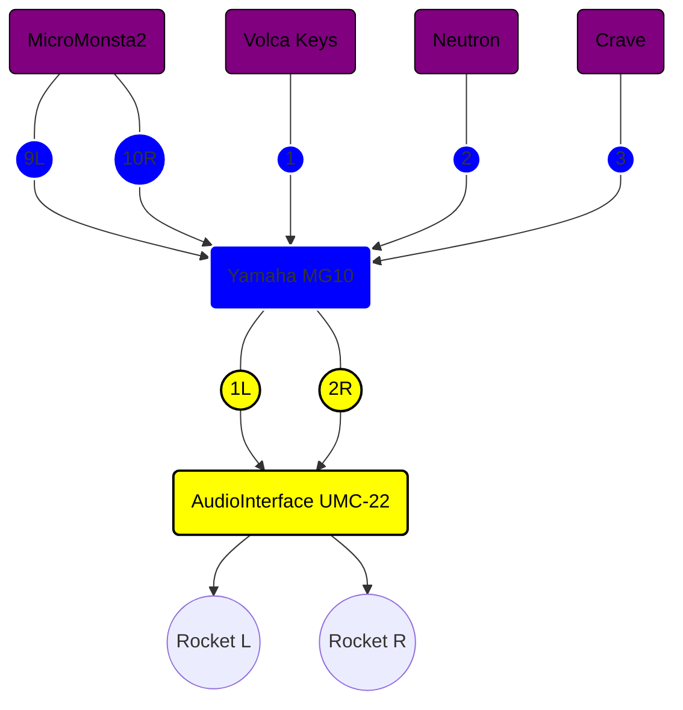

# Audio channel routing

```mermaid
graph TD;
classDef mixerclass fill:blue,stroke:white,stroke-width:2px;
classDef synthclass fill:purple,stroke:black,stroke-width:1px,color:black;
classDef soundclass fill:yellow,stroke:black,stroke-width:2px,color:black;

B(MicroMonsta2):::synthclass --- slotm9((9L)):::mixerclass --> A(Yamaha MG10);
B(MicroMonsta2) --- slotm10((10R)):::mixerclass --> A(Yamaha MG10);
C(Volca Keys):::synthclass --- slotm1((1)):::mixerclass --> A(Yamaha MG10);
D(Neutron):::synthclass --- slotm2((2)):::mixerclass --> A(Yamaha MG10);
E(Crave):::synthclass --- slotm3((3)):::mixerclass --> A(Yamaha MG10);
A(Yamaha MG10):::mixerclass --- slot1((1L)):::soundclass --> Z(AudioInterface UMC-22):::soundclass;
A(Yamaha MG10) --- slot2((2R)):::soundclass --> Z(AudioInterface UMC-22);
Z(AudioInterface UMC-22) --> mon1((Rocket L));
Z(AudioInterface UMC-22) --> mon2((Rocket R));
``` 
