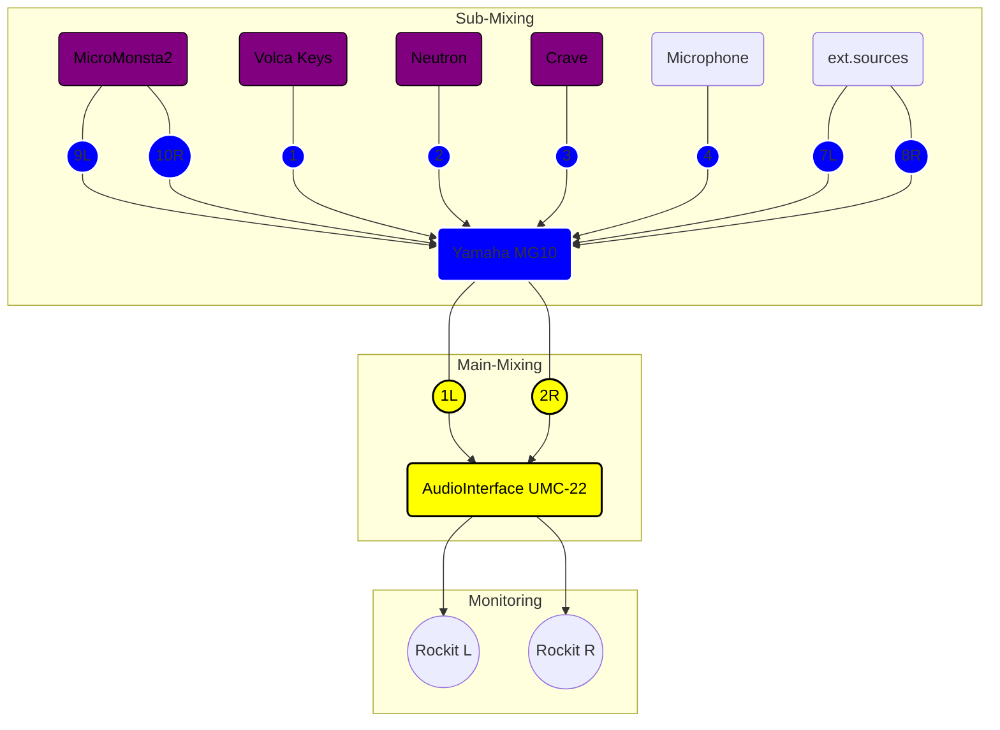

# Audio channel routing

```mermaid
graph TD;
classDef mixerclass fill:blue,stroke:white,stroke-width:2px;
classDef synthclass fill:purple,stroke:black,stroke-width:1px,color:black;
classDef soundclass fill:yellow,stroke:black,stroke-width:2px,color:black;
subgraph Sub-Mixing
B(MicroMonsta2):::synthclass --- slotm9((9L)):::mixerclass --> A(Yamaha MG10);
B(MicroMonsta2) --- slotm10((10R)):::mixerclass --> A(Yamaha MG10);
C(Volca Keys):::synthclass --- slotm1((1)):::mixerclass --> A(Yamaha MG10);
D(Neutron):::synthclass --- slotm2((2)):::mixerclass --> A(Yamaha MG10);
E(Crave):::synthclass --- slotm3((3)):::mixerclass --> A(Yamaha MG10);
F(Microphone) --- slotm4((4)):::mixerclass --> A(Yamaha MG10);
G(ext.sources) --- slotm7((7L)):::mixerclass --> A(Yamaha MG10);
G(ext.sources) --- slotm8((8R)):::mixerclass --> A(Yamaha MG10);
end
subgraph Main-Mixing
A(Yamaha MG10):::mixerclass --- slot1((1L)):::soundclass --> Z(AudioInterface UMC-22):::soundclass;
A(Yamaha MG10) --- slot2((2R)):::soundclass --> Z(AudioInterface UMC-22);
end
subgraph Monitoring
Z(AudioInterface UMC-22) --> mon1((Rockit L));
Z(AudioInterface UMC-22) --> mon2((Rockit R));
end
``` 
