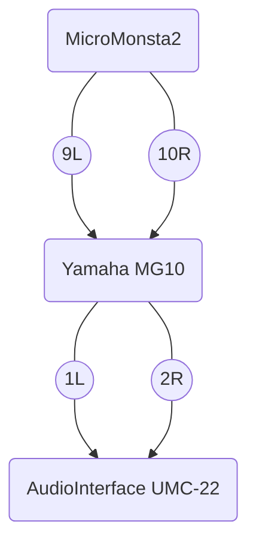

# Audio channel routing

```mermaid
graph TD; 
A(Yamaha MG10) --- slot1((1L)) --> Z(AudioInterface UMC-22);
A(Yamaha MG10) --- slot2((2R)) --> Z(AudioInterface UMC-22);
B(MicroMonsta2) --- slot9((9L)) --> A(Yamaha MG10);
B(MicroMonsta2) --- slot10((10R)) --> A(Yamaha MG10);
``` 
